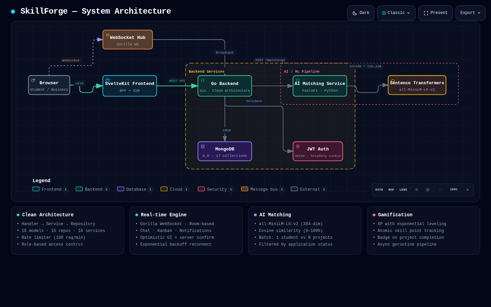
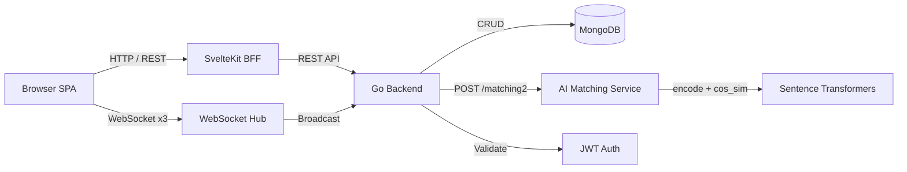
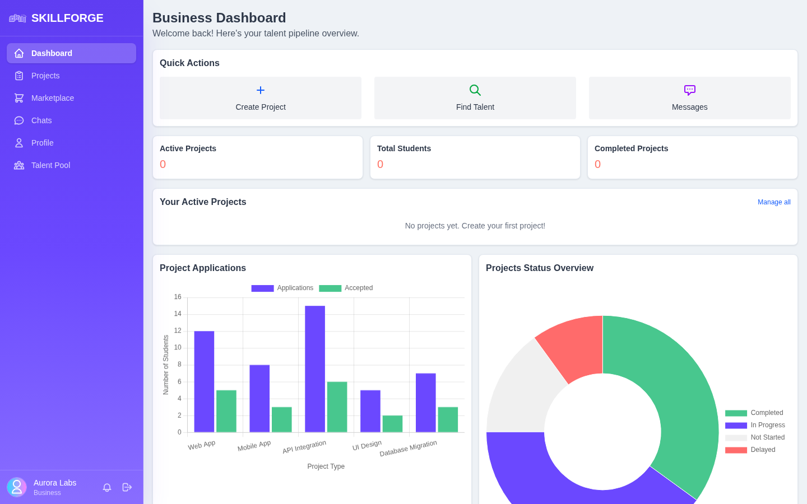
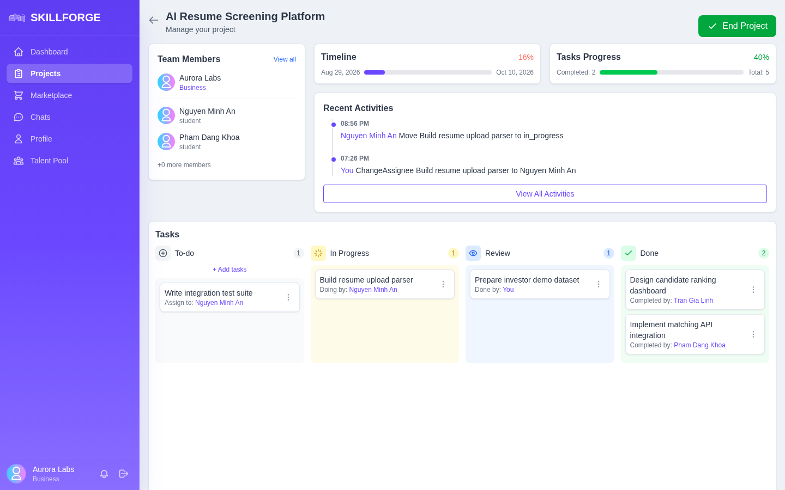
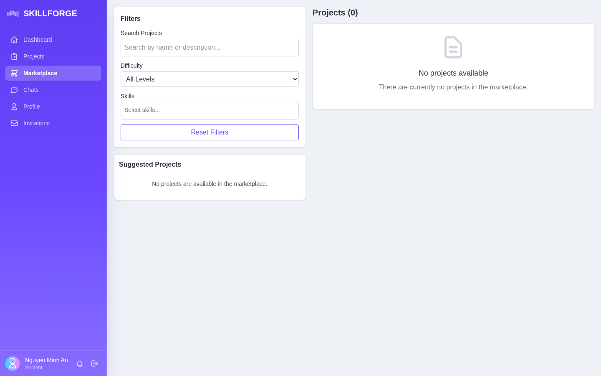
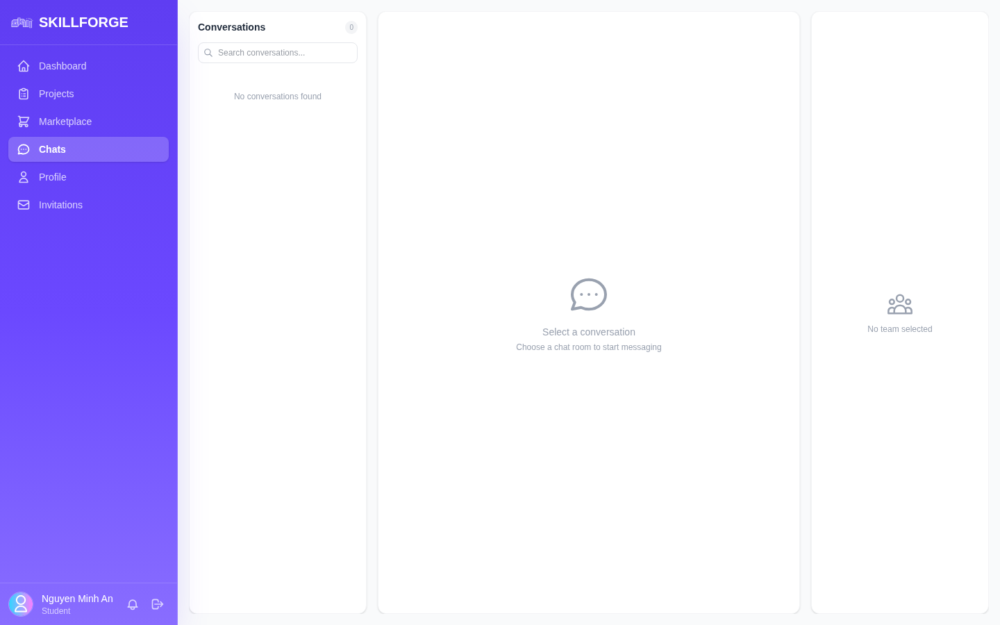
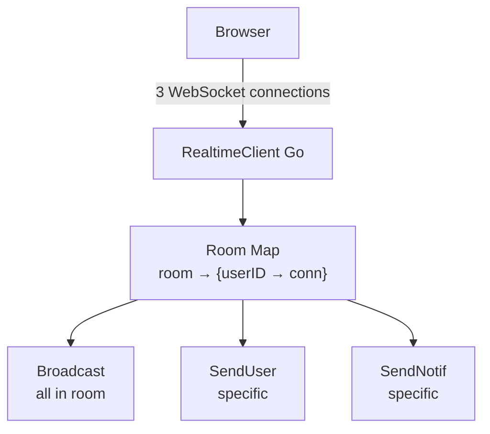
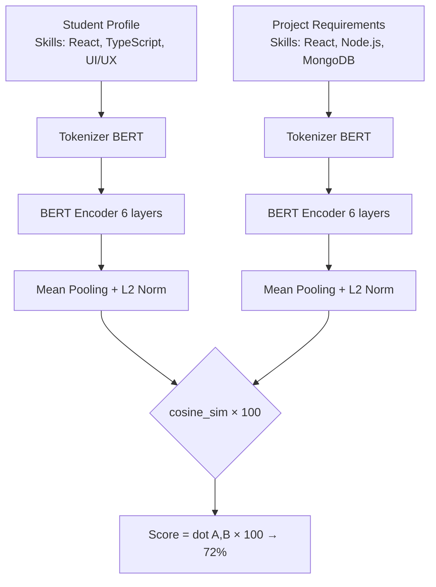

<p align="center"><em><a href="docs/skillforge-architecture.html">View Interactive Architecture Diagram</a></em></p>

<h1 align="center">SkillForge</h1>

<p align="center">
  <strong>AI-Powered Project-Student Matching Platform with Real-time Collaboration</strong>
</p>

<p align="center">
  <a href="#-tech-stack">Tech Stack</a> ·
  <a href="#-architecture">Architecture</a> ·
  <a href="#-getting-started">Getting Started</a> ·
  <a href="#-api-documentation">API</a> ·
  <a href="#-real-time-features">Real-time</a> ·
  <a href="#-ai-matching-algorithm">AI Matching</a>
</p>

<p align="center">
  
  
  
  
  
  
  
</p>

---

## Overview

**SkillForge** is a full-stack microservices platform that connects students with business projects through AI-powered skill matching. Built for the **Web Development Adventure UIT** program, it combines semantic similarity scoring, real-time collaboration, and gamification to create an engaging ecosystem where students find projects that best match their skills, and businesses discover the right talent.

### The Problem

Traditional project-student matching relies on manual review of resumes and skill lists — a time-consuming process that often results in poor matches. Students struggle to find projects where they can contribute meaningfully, while businesses waste time screening applicants whose skills don't align with project requirements.

### The Solution

SkillForge uses **sentence transformers** to encode student skills and project requirements into 384-dimensional vectors, computing cosine similarity scores to automatically rank the best matches. Combined with real-time Kanban boards, group chat, and a gamification system that rewards skill development, SkillForge transforms project collaboration into an engaging, data-driven experience.

---

## Key Features

| Feature | Description |
|---|---|
| **AI-Powered Matching** | Semantic similarity scoring using `all-MiniLM-L6-v2` sentence transformers — matches students to projects based on skill overlap, not just keyword matching |
| **Real-time Kanban Board** | Drag-and-drop task management with live synchronization across all team members via WebSocket |
| **Project Chat** | Group messaging within project teams with file sharing, optimistic UI, and real-time delivery |
| **Push Notifications** | Instant in-app notifications for application updates, task assignments, and team activity |
| **Gamification System** | XP leveling with exponential curves, skill point tracking, and badge awarding to incentivize participation |
| **Talent Pool** | Business-facing student discovery with skill-based search and portfolio browsing |
| **Invitation System** | Direct project invitations from businesses to students with one-click accept/decline |
| **Analytics Dashboard** | Chart.js-powered visualizations for skill assessment, project progress, and application metrics |
| **Portfolio Generation** | Auto-generated HTML portfolios from project participation and skill history |

---

## Architecture

SkillForge follows a **three-tier microservices architecture** with clear separation of concerns:

<p align="center">
  
</p>

<p align="center">
  <em>Generated with <a href="https://github.com/tt-a1i/archify">Archify</a> — open the live <a href="docs/skillforge-architecture.html">interactive diagram</a> for focus modes, zoom, and guided story views.</em>
</p>



### Architectural Decisions

| Decision | Rationale |
|---|---|
| **Go + Gin for backend** | High concurrency for WebSocket connections, excellent MongoDB driver, fast compilation |
| **SvelteKit as BFF** | Server-side rendering for SEO, API proxy layer to avoid CORS, seamless WebSocket upgrade |
| **Separate AI microservice** | Python ecosystem for ML libraries (PyTorch, sentence-transformers), independent scaling |
| **MongoDB** | Flexible schema for diverse entities (users, projects, tasks, messages), native JSON storage |
| **Room-based WebSocket** | Scalable pub/sub pattern — each project gets its own room, notifications use a global room |
| **Clean Architecture** | Handler → Service → Repository layers enable testability and clear dependency flow |

---

## Screenshots

**Product UI** — *coming soon* (see TODOs below):

<!-- TODO: Add product screenshots after demo recording -->

| Dashboard | Kanban Board | AI Matching | Chat |
|---|---|---|---|
|  |  |  |  |

---

## Tech Stack

### Backend

| Component | Technology | Purpose |
|---|---|---|
| HTTP Framework | [Gin](https://github.com/gin-gonic/gin) | High-performance HTTP router |
| Database | [MongoDB 6.0](https://www.mongodb.com/) | Primary data store (17 collections) |
| WebSocket | [Gorilla WebSocket](https://github.com/gorilla/websocket) | Real-time bidirectional communication |
| Authentication | [JWT](https://github.com/golang-jwt/jwt) (HS256) | Stateless auth with httpOnly cookies |
| Password Hashing | bcrypt | Secure password storage |
| Validation | [go-playground/validator](https://github.com/go-playground/validator) | Struct-level input validation |
| Email | [gomail](https://github.com/go-gomail/gomail) | SMTP email delivery |
| Containerization | Docker + CompileDaemon | Hot-reload development |

### Frontend

| Component | Technology | Purpose |
|---|---|---|
| Framework | [SvelteKit](https://kit.svelte.dev/) (Svelte 5) | SSR + BFF pattern |
| Styling | [Tailwind CSS v4](https://tailwindcss.com/) | Utility-first CSS |
| Charts | [Chart.js 4](https://www.chartjs.org/) | Dashboard data visualization |
| Drag & Drop | [SortableJS](https://sortablejs.github.io/Sortable/) | Kanban board interactions |
| Language | TypeScript | Type safety |
| Testing | Vitest (unit) + Playwright (e2e) | Quality assurance |

### AI / ML

| Component | Technology | Purpose |
|---|---|---|
| Framework | [FastAPI](https://fastapi.tiangolo.com/) | Async Python API server |
| Embeddings | [Sentence Transformers](https://www.sbert.net/) | Text → vector encoding |
| Model | `all-MiniLM-L6-v2` | 384-dim semantic embeddings |
| Similarity | Cosine similarity | Student-project matching |

### Infrastructure

| Component | Technology | Purpose |
|---|---|---|
| Orchestration | Docker Compose | Multi-service deployment |
| Database | MongoDB 6.0 | Document store |
| Network | Bridge network (`app-network`) | Service discovery |
| Storage | Local filesystem | Avatars, portfolios, chat files |

---

## Project Structure

```
SkillForge/
├── backend/                          # Go backend service
│   ├── cmd/
│   │   ├── main.go                   # Entry point → app.Run()
│   │   └── seed_demo/main.go         # Demo data seeder
│   ├── internal/
│   │   ├── app/
│   │   │   ├── app.go                # Bootstrap: MongoDB, DI, Gin server
│   │   │   └── routes.go            # All API route registration
│   │   ├── config/                   # Environment configuration
│   │   ├── constants/                # Roles, errors, limits, skills
│   │   ├── handlers/                 # 20 HTTP handler files
│   │   │   ├── auth.go              # Register, Login, Logout
│   │   │   ├── projects.go          # CRUD + marketplace
│   │   │   ├── matching.go          # AI match score endpoints
│   │   │   ├── websocket_chat.go    # Chat WebSocket handler
│   │   │   ├── websocket_task.go    # Kanban WebSocket handler
│   │   │   └── websocket_notification.go
│   │   ├── integrations/             # External service clients
│   │   │   ├── ai.go                # FastAPI AI matching client
│   │   │   ├── realtime.go          # Gorilla WebSocket hub
│   │   │   ├── email.go             # SMTP client
│   │   │   └── storage.go           # File storage backend
│   │   ├── middleware/               # Auth, logging, rate limiting, roles
│   │   ├── models/                   # 18 MongoDB document schemas
│   │   ├── repositories/             # 17 data access layer files
│   │   ├── services/                 # 18 business logic files
│   │   └── utils/                    # JWT, helpers, errors, validator
│   ├── storage/                      # Runtime file storage
│   └── tests/                        # Organized by layer
│
├── frontend/                         # SvelteKit frontend
│   ├── src/
│   │   ├── routes/                   # File-system routing
│   │   │   ├── dashboard/           # Chart.js analytics
│   │   │   ├── project/             # CRUD + Kanban board
│   │   │   ├── marketplace/         # Browse + AI suggestions
│   │   │   ├── chat/                # Real-time messaging
│   │   │   ├── profile/             # User profiles + badges
│   │   │   ├── invitations/         # Project invites
│   │   │   ├── talent/              # Student talent pool
│   │   │   └── api/                 # 25+ BFF proxy endpoints
│   │   ├── components/               # Nav, ConfirmModal, taskUtils
│   │   └── lib/                      # Backend URL config
│   ├── e2e/                          # Playwright tests
│   └── static/                       # Static assets
│
├── ai/                               # Python AI matching service
│   ├── main.py                       # FastAPI app + routes
│   ├── matching/
│   │   ├── model.py                  # Sentence Transformer inference
│   │   └── matching-model/           # Bundled all-MiniLM-L6-v2
│   └── Dockerfile                    # Python 3.11 + CPU PyTorch
│
├── docker-compose.yml                # 4-service orchestration
└── docs/
    ├── skillforge-architecture.html  # Interactive architecture diagram
    └── skillforge-architecture.json  # Archify specification
```

---

## Getting Started

### Prerequisites

- [Docker Desktop](https://www.docker.com/products/docker-desktop/) (running on WSL2)
- 4 GB RAM allocated to Docker

### Quick Start (Docker)

```bash
# Clone the repository
git clone https://github.com/iknizzz1807/SkillForge.git
cd SkillForge

# First run — builds all images
docker-compose up --build -d

# Subsequent runs
docker-compose up -d
```

### Services

| Service | URL | Description |
|---|---|---|
| Frontend | `http://localhost:5173` | SvelteKit BFF |
| Backend API | `http://localhost:8080` | Go REST API |
| AI Service | `http://localhost:5000` | Python matching service |
| MongoDB | `mongodb://localhost:27017` | Database |

### Development Setup

<details>
<summary><strong>Backend (Go)</strong></summary>

```bash
cd backend
go mod download
go run cmd/main.go
```

Environment variables (`.env`):
```
MONGO_URI=mongodb://localhost:27017/skillforge
JWT_SECRET=your-secret-key
AI_URL=http://localhost:5000
JWT_EXPIRY_HOURS=24
```
</details>

<details>
<summary><strong>Frontend (SvelteKit)</strong></summary>

```bash
cd frontend
npm install
npm run dev
```

Environment variables (`.env`):
```
PUBLIC_API_URL=http://localhost:8080
PUBLIC_WS_URL=ws://localhost:8080
BACKEND_URL=http://localhost:8080
```
</details>

<details>
<summary><strong>AI Service (Python)</strong></summary>

```bash
cd ai
pip install -r requirements.txt
python main.py
```
</details>

---

## API Documentation

### Authentication

| Method | Endpoint | Body | Description |
|---|---|---|---|
| `POST` | `/auth/register` | `multipart` (email, name, password, role, avatar?) | Create account |
| `POST` | `/auth/login` | `{email, password}` | Get JWT token |
| `POST` | `/api/logout` | — | Clear session |

### Projects

| Method | Endpoint | Access | Description |
|---|---|---|---|
| `GET` | `/api/projects` | Any | Browse open projects |
| `GET` | `/api/projects/:id` | Any | Project detail + join status |
| `POST` | `/api/projects` | Business | Create project |
| `PUT` | `/api/projects/:id` | Business (owner) | Update project |
| `DELETE` | `/api/projects/:id` | Business (owner) | Close project |
| `GET` | `/api/projects/business` | Business | My projects |
| `GET` | `/api/projects/student` | Student | Joined projects |

### Matching

| Method | Endpoint | Access | Description |
|---|---|---|---|
| `GET` | `/api/matches` | Student | Top 10 project matches |
| `GET` | `/api/matches/:project_id` | Student | Score for specific project |

### Applications

| Method | Endpoint | Access | Description |
|---|---|---|---|
| `POST` | `/api/applications` | Student | Apply to project |
| `GET` | `/api/applications/me` | Any | My applications (role-based) |
| `PUT` | `/api/applications/status/:id` | Business | Approve/reject |

### Gamification

| Method | Endpoint | Access | Description |
|---|---|---|---|
| `GET` | `/api/levels` | Any | XP and level info |
| `GET` | `/api/skills` | Any | Skill points |
| `GET` | `/api/badges/:userID` | Any | Earned badges |

### Chat & Notifications

| Method | Endpoint | Access | Description |
|---|---|---|---|
| `GET` | `/api/chats` | Any | Chat rooms |
| `POST` | `/api/chats/upload` | Any | Upload file |

---

## Real-time Features

SkillForge uses a **room-based WebSocket architecture** with three distinct channels:

### WebSocket Endpoints

```
ws://localhost:8080/ws/task/:projectID/:userID     → Kanban board
ws://localhost:8080/ws/chats/:projectID/:userID     → Group chat
ws://localhost:8080/ws/notifi/:userID               → Notifications
```

### 1. Kanban Task Board

- **Room:** `{projectID}` — all project members share one room
- **Operations:** Create, update, delete tasks with live broadcast
- **Sync:** After every mutation, full task list + activity log is re-fetched and broadcast
- **Frontend:** SortableJS drag-and-drop with custom ghost/chosen/drag styles

### 2. Group Chat

- **Room:** `message` — global message hub, client-side filtering by project
- **Features:** Text messages, file attachments, optimistic UI
- **Persistence:** Every message is stored in MongoDB before broadcast
- **Reconnection:** Exponential backoff with page-visibility awareness

### 3. Push Notifications

- **Room:** `notification` — global room, one connection per user
- **Events:** Application updates, task assignments, invitations
- **Delivery:** Server pushes; client maintains persistent connection

### Real-time Architecture



---

## AI Matching Algorithm

### How It Works

The matching system uses **semantic similarity** to pair students with relevant projects:



### Model Details

| Property | Value |
|---|---|
| Model | `all-MiniLM-L6-v2` |
| Architecture | BERT (6 layers, 12 heads) |
| Hidden Size | 384 dimensions |
| Max Sequence Length | 256 tokens |
| Pooling | Mean pooling |
| Normalization | L2 (unit vectors) |
| Training Data | 1.17 billion sentence pairs |
| Output Range | 0–100% (cosine similarity × 100) |

### Request Flow

```
1. Student requests matches → GET /api/matches
2. Go backend queries MongoDB for:
   - User skills + title → "React TypeScript UI/UX Frontend Developer"
   - All open projects → skills + title + description
   - Filter out already applied/joined projects
3. Batch POST to AI service → /matching2
4. Python service encodes all texts → 384-dim vectors
5. Computes cosine similarity for each student-project pair
6. Returns list of float scores
7. Go backend rounds scores, sorts descending
8. Returns top 10 matches to frontend
```

### Performance

- **Model Load Time:** ~2s (bundled locally, no HuggingFace download)
- **Inference:** ~50ms per student-project pair
- **Batch Mode:** Single student text encoded once, compared against N projects
- **Total Latency:** <200ms for 10-project matching

---

## Database Schema

### Collections (17 total)

| Collection | Purpose | Key Fields |
|---|---|---|
| `users` | Student & business profiles | email, name, password (bcrypt), role, skills[], avatar |
| `projects` | Project listings | title, description, skills[], max_member, difficulty, status |
| `project_student` | Many-to-many join | project_id, student_id |
| `tasks` | Kanban items | project_id, title, status (todo/in_progress/review/done) |
| `activities` | Audit trail | type, done_by, project_id, from, to |
| `applications` | Join requests | user_id, project_id, motivation, status |
| `messages` | Chat messages | sender_id, group_id, content, type (text/file) |
| `groups` | Chat rooms | project_id, title |
| `notifications` | Push alerts | to_user_id, content, type |
| `badges` | Badge definitions | code, name, type, prerequisites |
| `user_badges` | Earned badges | user_id, badge_id, awarded_at |
| `user_levels` | XP tracking | user_id, level, xp_needed, xp_current |
| `user_skills` | Skill points | user_id, skill, level, point_current |
| `reviews` | Task reviews | user_id, task_id, score (1-10), comment |
| `feedbacks` | Project feedback | project_id, from_id, rating (0-5), content |
| `portfolios` | User portfolios | user_id, projects[], skills[] |
| `invitations` | Project invites | project_id, student_id, business_id, status |

### Indexes

```javascript
// Performance-critical indexes
users:            { email: 1 }                    // unique
projects:         { created_by_id: 1, status: 1, skills: 1 }
messages:         { group_id: 1, created_at: -1 } // compound
project_student:  { student_id: 1 }
user_levels:      { user_id: 1 }
user_skills:      { user_id: 1, skill: 1 }        // compound
```

---

## Gamification System

### XP & Leveling

| Action | XP Award |
|---|---|
| Join a project (approved application) | 50 XP |
| Accept an invitation | 50 XP |
| Complete a task (status → "done") | 10 XP |
| Project closed (per student) | 100 XP |

**Leveling Formula:**
```
XP needed for level N = round(100 × 1.5^(N-1) / 5) × 5

Level 1 → 2: 100 XP
Level 2 → 3: 150 XP
Level 3 → 4: 225 XP
Level 4 → 5: 340 XP
...
```

### Skill Points

Track proficiency in specific skills based on project participation:

```
Level 1 → 2: 1 project
Level 2 → 3: 4 projects
Level 3 → 4: 6 projects
```

### Badge System

| Badge Type | Trigger | Example |
|---|---|---|
| `skill` | Work on a project requiring that skill | "React Developer" |
| `project` | Project status → "closed" | "Project Completer" |
| `completion` | Complete all tasks in a project | "Task Master" |

**Atomic Operations:** XP and skill point increments use MongoDB `FindOneAndUpdate` with `$inc` and `$setOnInsert` to prevent race conditions in concurrent environments.

---

## Contributing

1. Fork the repository
2. Create a feature branch (`git checkout -b feature/amazing-feature`)
3. Commit changes (`git commit -m 'Add amazing feature'`)
4. Push to branch (`git push origin feature/amazing-feature`)
5. Open a Pull Request

### Development Guidelines

- Follow **Clean Architecture** patterns in the backend (Handler → Service → Repository)
- Use **Svelte 5 runes** (`$state`, `$derived`, `$effect`) in the frontend
- Write **Vitest** unit tests for new business logic
- Add **Playwright** e2e tests for new user flows
- Run `go vet ./...` and `npm run lint` before committing

---

## License

This project is licensed under the **Apache License 2.0** — see the [LICENSE](LICENSE) file for details.

---

## Acknowledgments

- Built as part of **Web Development Adventure UIT** program
- AI matching powered by [Sentence Transformers](https://www.sbert.net/) and [HuggingFace](https://huggingface.co/)
- Real-time features powered by [Gorilla WebSocket](https://github.com/gorilla/websocket)
- Architecture documented with [Archify](https://github.com/tt-a1i/archify)

---

<p align="center">
  <strong>Nguyen My Thong</strong> · <a href="mailto:mythonggg@gmail.com">mythonggg@gmail.com</a> · <a href="https://github.com/iknizzz1807">GitHub</a>
</p>
